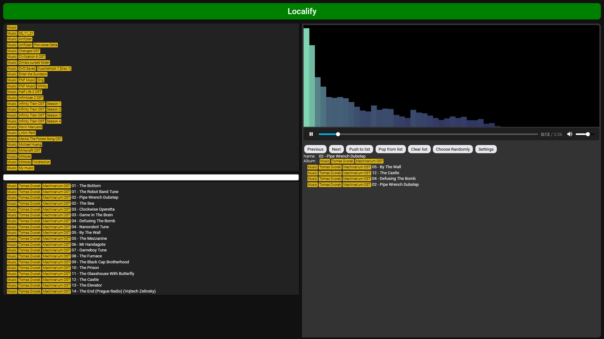

Localify
=======

It's a single-page website, what can play music from local device, your computer or server(soon), as you opening any media player.

Before entering to `Localify.html`
-----------------

You can set where should you search music in `pathToCheckItOut.txt`, or reducing target music files in `ignore.txt` and run `WritePathsToContent.ps1` for automatic detection and outputing `content.txt`, or you can fill it manually.
Also you should **TURN OFF CORS IN YOUR BROWSER IN CASE OF USING OR DEVELOPING THIS REPOSITORY**

Interface
-----------------

What it can?
-----------------

Except listening music, you can create your own playlist and watching satisfying equalizer visualisation, or at least save your GPU. It's based on browser build-in player, so you can manually set, whatever you want. You also can watch all music in a single list, or select from your folder music.

Compatatility
----------------

You can already use Localify if you're in Windows.
It requires .sh script to use it in Linux, MacOS or Server-side computers.
